# システムプログラミングの本番環境にデプロイする

## 本番環境の説明

- 櫨山研究室のサーバルームには何台かサーバがありますが、そのうちの1台（`onyx.u-gakugei.ac.jp`）が、システムプログラミングなどのソフトウェア開発PBLの本番環境用として割り当てられています。
- 本番環境には、次のものが備わっています。
    - **コンテナレジストリ**: 開発したアプリをコンテナイメージとして保存するためのシステム。
    - **コンテナ実行環境**: コンテナイメージを実行するためのソフトウェア。
    - **Portainer**: コンテナ実行環境を操作するためのWebアプリ。櫨山研究室のPortainerは本番環境のサーバでしか使えないようになっていますが、手元のPCをSSH経由で本番環境に接続して、Portainerが割り当てられているTCPポートを手元のPCに引き込むことで、手元のPCからPortainerが使えるようになります。
- したがって、デプロイのために次の作業を行っていただきます。
    - 事前準備として、SSHの鍵ペアの生成や設定ファイルの作成
    - GitHub Actionsを使ってコンテナイメージを作成して、コンテナレジストリにアップロードさせる作業
    - Portainerでコンテナを実行する作業

## 事前準備：本番環境のSSHサーバに接続できるようにする

### 1. SSHの鍵ペアを生成してサーバ管理者に渡す

1. SSH鍵ペアを生成する。
    ```sh
    ssh-keygen -t ed25519 # ed25519という形式の鍵を生成する
    ```
    パスフレーズの入力を求められたら、パスフレーズを入力して、パスフレーズ付きの鍵ペアを作成するようにしてください。パスフレーズはSSH経由でサーバーにログインする際など、SSH鍵ペアを利用する際に入力が求められるものであり、パスフレーズを知らない人には使用できない鍵ペアにすることができます。
2. パスフレーズの入力を省略できるように、SSHエージェントに鍵を追加する。
    - macOSの場合
        ```sh
        ssh-add --apple-use-keychain
        ```
    - Windowsの場合
        ```ps
        ssh-add
        ```
    - パスフレーズの入力を求められたら、手順1で設定したパスフレーズを入力してください。
3. 生成された鍵ペアのうち、公開鍵を確認する。
    - **秘密鍵はPCの外に出さないようにしてください。**
    - macOS: `~/.ssh/id_ed25519.pub`に配置されています。
        ```sh
        cat ~/.ssh/id_ed25519.pub
        ```
    - Windows（PowerShell）: `%USERPROFILE%\.ssh\id_ed25519.pub`に配置されています。
        ```ps
        cat %USERPROFILE%\.ssh\id_ed25519.pub
        ```
4. 授業内で指定された方法で公開鍵をインスペクタに渡してください。本番環境のSSHサーバに接続できるように、サーバ管理者が設定してくれます。

### 2. SSHの設定

1. SSHの設定ファイルに次の内容を書き込む。
    - 設定ファイルのパス
        - macOS: `~/.ssh/config`
        - Windows: `%USERPROFILE%\.ssh\config`
    - 文字コードはUTF-8、改行コードはLFで保存してください。
    - 内容
        ```
        Host garnet
          User guest
          HostName garnet.u-gakugei.ac.jp
          Port 22
          LocalForward 9033 localhost:9443

        Host onyx
          User guest
          HostName onyx.u-gakugei.ac.jp
          Port 22
          ProxyJump garnet
          LocalForward 9036 localhost:9443
        ```

## 初回のデプロイを行う

### 1. コミットにタグを付けて本番環境のコンテナレジストリにコンテナイメージをアップロードする

1. Webブラウザで[GitHubのリポジトリのホーム画面](../../)にアクセスします。
2. `Releases`をクリックして、タグの一覧を表示します。
    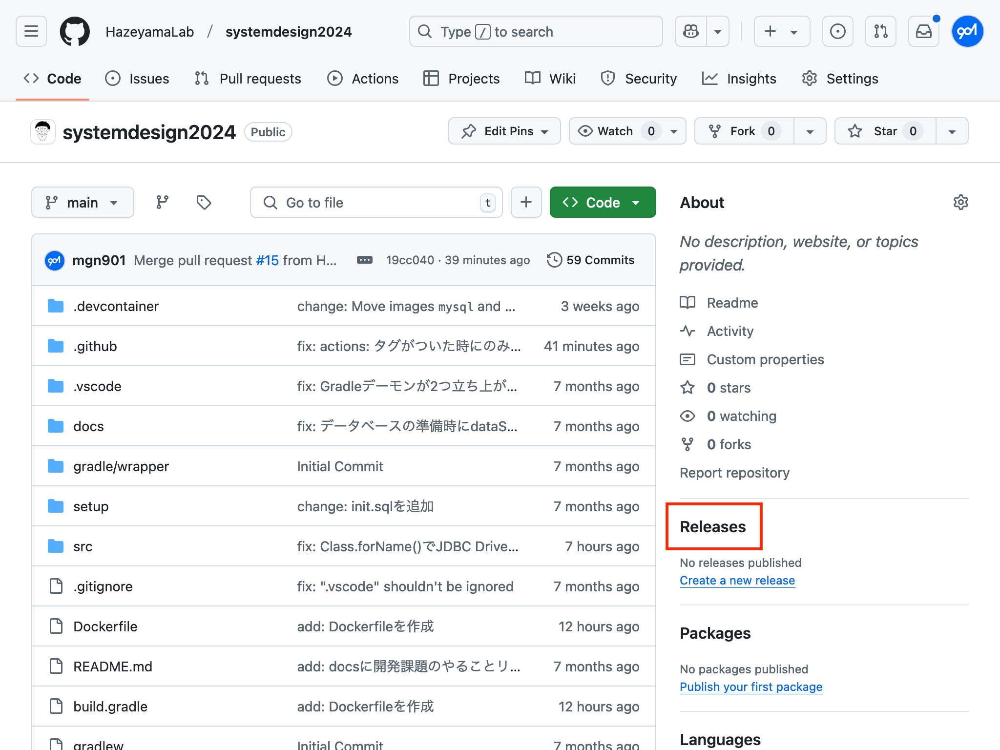
3. `Create new release`をクリックして、タグの作成画面を表示します。
    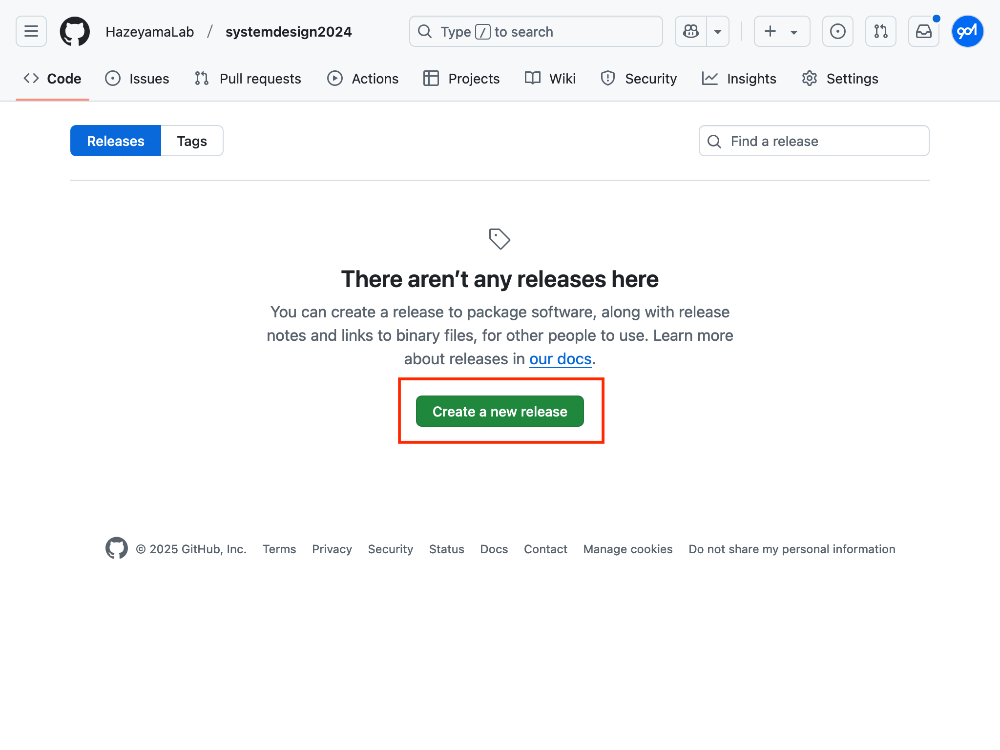
4. タグを作成します。
    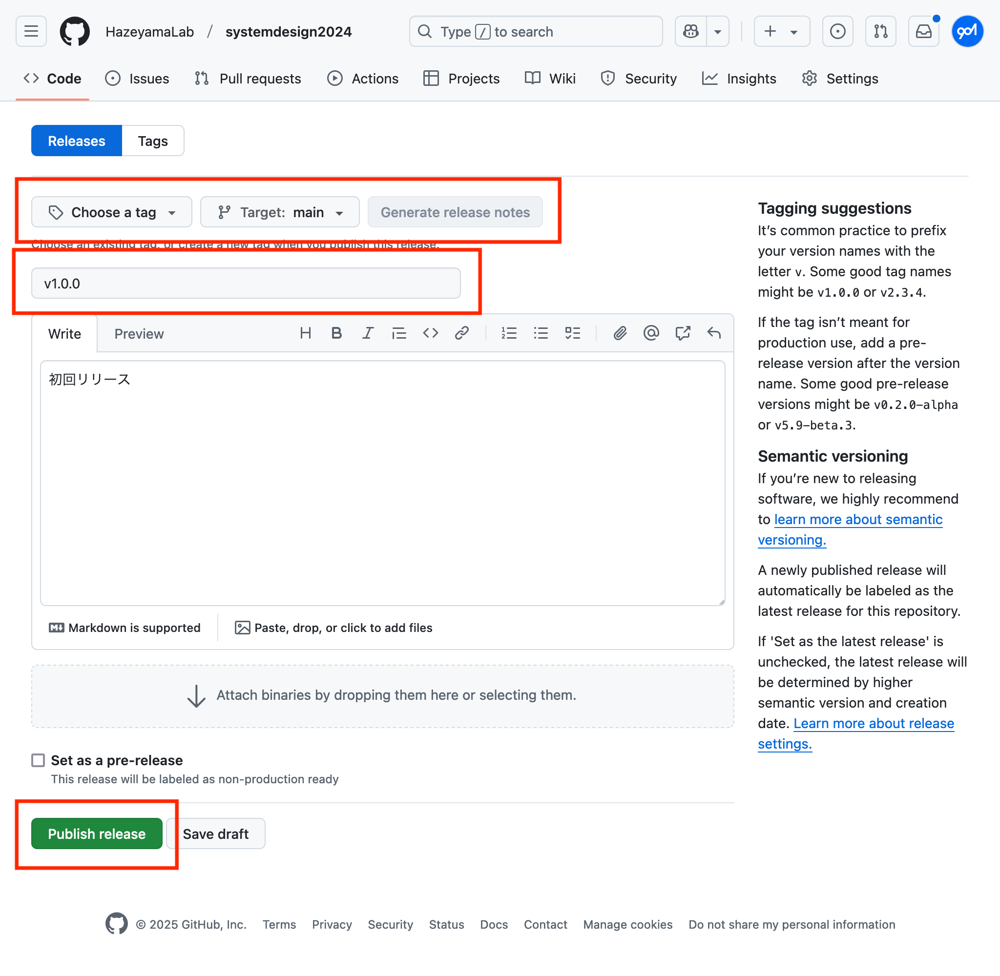
    - Choose a tag: クリックすると入力欄が現れます。入力欄にバージョン名（`v1.0.0`など。最初に`v`を付けてください）を入力してタグを作成してください。
    - Target: どのブランチが指すコミットにタグを付けるのか、選んでください。
    - Release Title: `v1.0.0`などと入力します。最初に`v`を付けてください。
    - `Generate release notes`ボタンをクリックすると、リリースまでのプルリクエストなどの一覧をまとめてくれます。
    - 最後に`Publish release`ボタンをクリックしてください。
5. タグが作成されます。タグが作成されると、タグを付けたブランチが指すコミットのソースコードを基にコンテナイメージが作成され、本番環境のコンテナレジストリにアップロードされます。
    - 本番環境のコンテナレジストリにアップロードされるまでには、初回の場合は約2分の時間を要します。GitHubの画面の`Actions`タブから、コンテナイメージ作成の進捗状況を確認することができます。
    - 
### 2. 本番環境に接続する

1. 本番環境のSSHサーバに接続する。
    - 次のコマンドで`onyx.u-gakugei.ac.jp`のSSHサーバに接続する。
        ```sh
        ssh -N onyx
        ```
    - パスフレーズを聞かれたらパスフレーズを入力してください。`ssh-add`が効いている場合は聞かれないこともあります。
    - `The authenticity of host ...`と聞かれたら`yes`と入力してください。
    - パスフレーズや`The authenticity of host ...`は2回聞かれることがあります。
    - 接続に成功すると、**何も表示されないか、何も表示されずにコマンドが終了してローカルのシェルに帰らされますが、正常です**。
2. Portainerにログインする。
    - Portainerが割り当てられているTCPポートは、事前準備での設定とSSHサーバーへの接続によって https://localhost:9036 に引き込んであります。Webブラウザで https://localhost:9036 にアクセスしてください。
    - 画面の指示に従い、インスペクタから渡された認証情報を使ってログインしてください。
    - 初回アクセス時はWebブラウザからセキュリティの警告が表示されることがあります。これはPortainerがオレオレ証明書を使っているという仕様のために表示されるものです。`詳細表示`などのボタンをクリックすると、警告を回避してアクセスするためのボタンが表示されるので、それをクリックしてアクセスしてください。
    - ログインに成功すると、PortainerのHome画面が表示されます。

### 3. PortainerでStackを作成する

Portainerでは各アプリのシステムに必要なコンテナ群を「Stack」という単位で管理しています。デプロイするためにはStackを作成してください。

1. Home画面には本番環境のサーバの一覧が表示されています。`onyx`の`Live connect`ボタンをクリックして、ダッシュボードを表示します。
    - 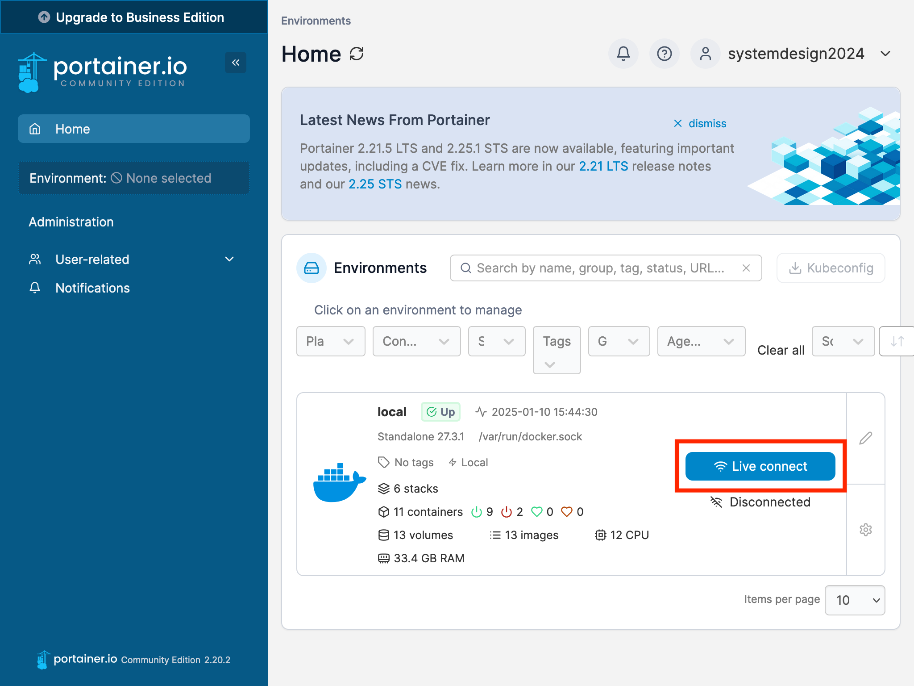
2. `Stacks`をクリックして、Stackの一覧画面を表示します。
    - 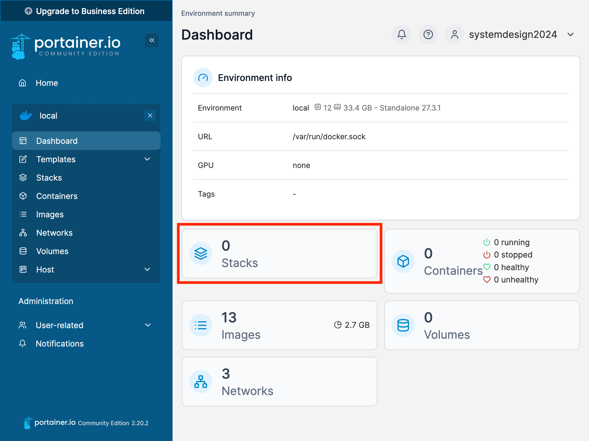
3. `Add stack`をクリックして、Stackの作成画面を表示します。
    - 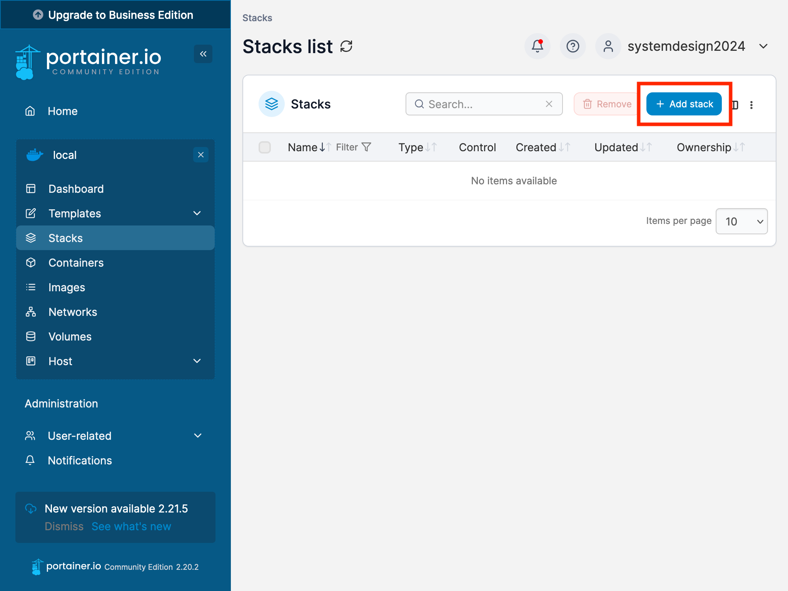
4. Stackを作成してください。
    - 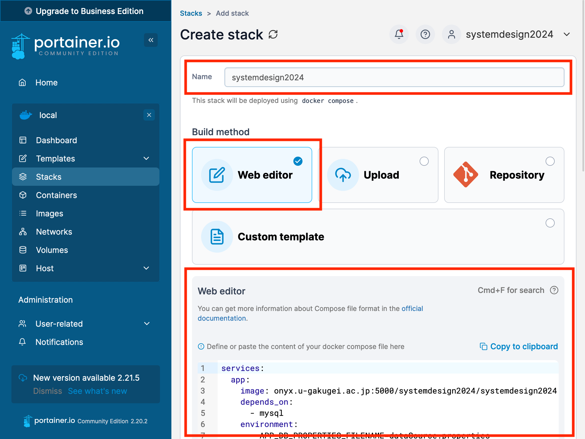
    - 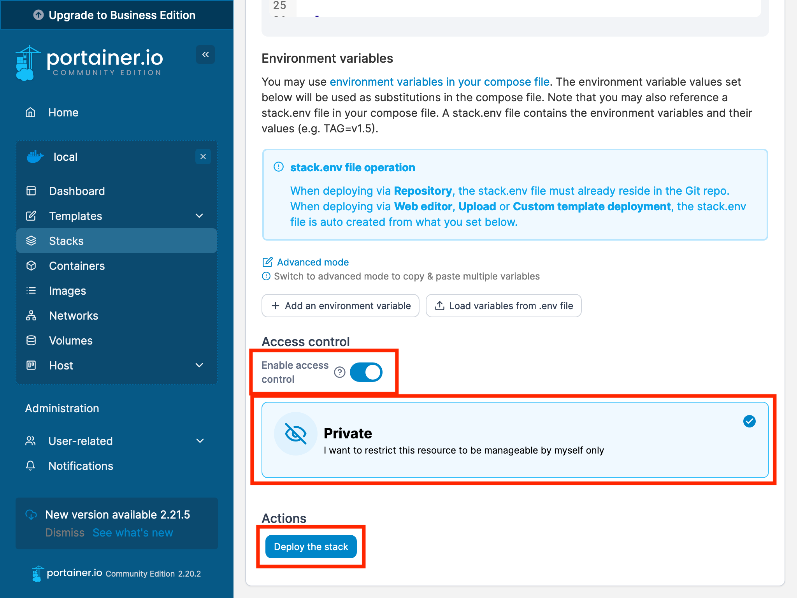
    - Name: `se25g2`
    - Build method: `Web editor`
    - Web editorに次の内容を入力してください（コピーボタンを押してコピーしてください）。
      ```yaml
      services:
        app:
          image: onyx.u-gakugei.ac.jp:5000/se25g2/se25g2:latest
          depends_on:
            - mysql
          restart: always
          environment:
            - APP_DB_PROPERTIES_FILENAME=se25g2DataSource.properties
          networks:
            - proxy
            - default
        mysql:
          image: mysql:latest
          restart: always
          environment:
            - TZ=Asia/Tokyo
            - MYSQL_ROOT_PASSWORD=password
            - MYSQL_DATABASE=initdb
            - MYSQL_USER=mysql
            - MYSQL_PASSWORD=password
          command: --character-set-server=utf8mb4 --collation-server=utf8mb4_unicode_ci --key_buffer_size=1048576 --myisam_sort_buffer_size=1048576 --innodb_buffer_pool_size=5242880 --innodb_log_buffer_size=1048576 --innodb_log_file_size=4194304 --max-connections=24 --open_files_limit=1024 --table_definition_cache=400 --table_open_cache=256
          volumes:
            - mysql_data:/var/lib/mysql
          networks:
            - default

      volumes:
        mysql_data:

      networks:
        default:
        proxy:
          external: true
      ```
    - Enable access control: オンにして`Private`を選択する。
    - 最後に`Deploy the stack`ボタンをクリックしてください。
7. Stackの作成に成功すると、Stackの一覧に`se25g2`が表示されます。
    - 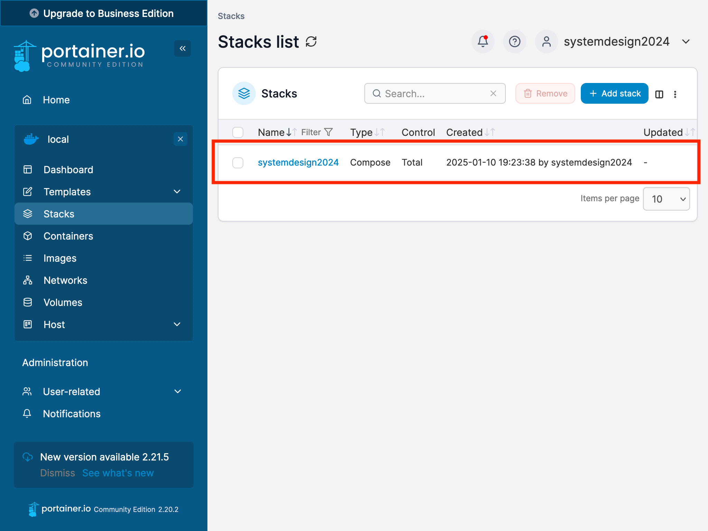

### 4. mysqlコンテナでデータベースを初期化するためのSQLを実行する

1. Stackの一覧画面から`se25g2`をクリックして、Stackの編集画面を表示します。
    - 
2. コンテナの一覧から`se25g2-mysql-1`をクリックして、コンテナの編集画面を表示します。
    - 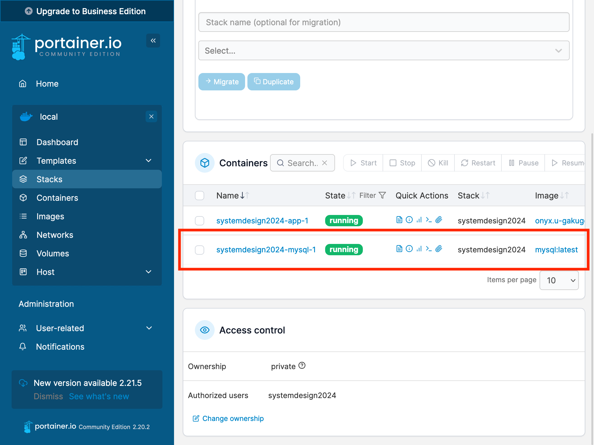
3. `Container status`の下部にある`Console`をクリックして、コンテナのコンソール接続画面を表示します。
    - 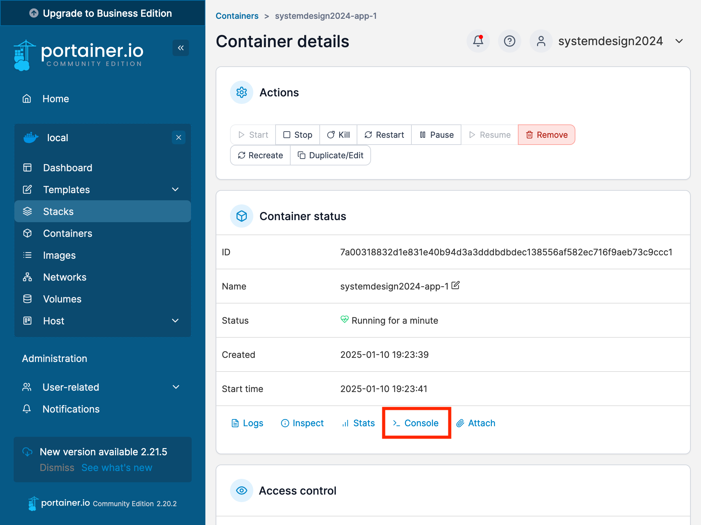
4. Commandを`/bin/bash`にして、`Connect`をクリックして、コンテナのコンソールに接続します。（`/bin/bash`が使えなかった場合は`/bin/sh`を使ってください）
    - 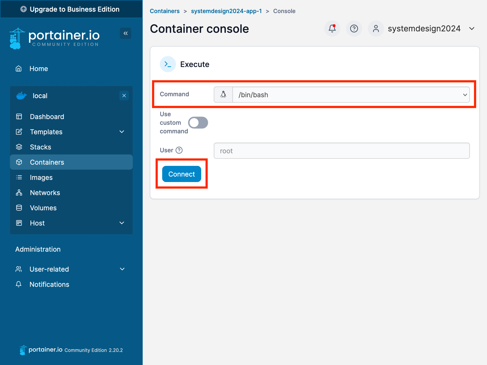
5. MySQLに`root`ユーザでログインして、`mysql`ユーザに`database`データベースに対する権限を付与するためのSQLを実行してください。
    ```sh
    # MySQLに`root`ユーザでログインするためのコマンド。
    mysql -u root -p
    ```
    ```sql
    -- `mysql`ユーザに`database`データベースに対する権限を付与するためのSQL

    -- データベース`database`を作成する。
    create database `database`;

    -- `mysql`ユーザーが`database`データベースを操作できるようにする。
    grant all privileges on `database`.* to `mysql`@`%`;
    ```
6. さらに、`database`データベースにテーブルを用意するためのSQLを実行してください。

### 5. 動作確認をする

- https://onyx.u-gakugei.ac.jp/se25g2 配下のURLにアクセスして動作確認をしてください。
- デプロイが完了したらインスペクタに連絡してください。

## 2回目以降のデプロイを行う

### 1. コミットにタグを付けて本番環境にコンテナイメージをアップロードする

[1回目のデプロイと同じ方法](#1-コミットにタグを付けて本番環境のコンテナレジストリにコンテナイメージをアップロードする)で、コミットにタグを付けて本番環境にコンテナイメージをアップロードしてください。

### 2. PortainerでWebアプリのコンテナを再作成する

1. Stackの一覧画面から`se25g2`をクリックして、Stackの編集画面を表示します。
    - 
2. コンテナの一覧から`se25g2-app-1`をクリックして、コンテナの編集画面を表示します。
    - 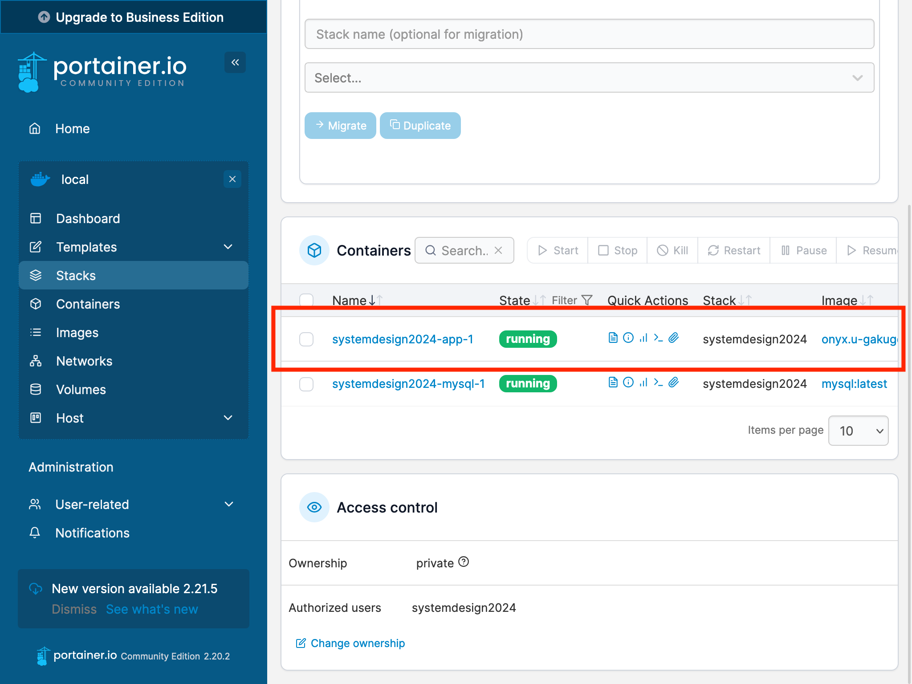
3. `Actions`の中にある`Recreate`をクリックしてください。
    - 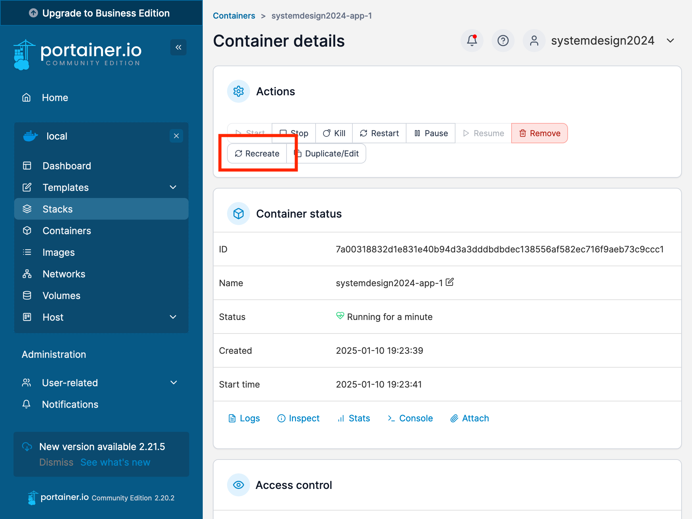
4. ダイアログの`Re-pull image`をオンにしてから`Recreate`をクリックしてください。
    - 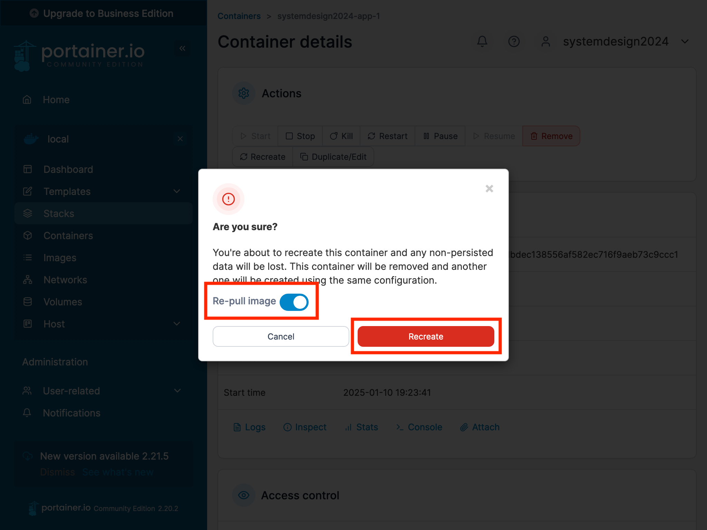
5. コンテナの再作成に成功すると、右上に`Container successfully re-created`と表示されます。

### 3. 動作確認をする

- https://onyx.u-gakugei.ac.jp/se25g2 配下のURLにアクセスして動作確認をしてください。
- デプロイが完了したらインスペクタに連絡してください。
