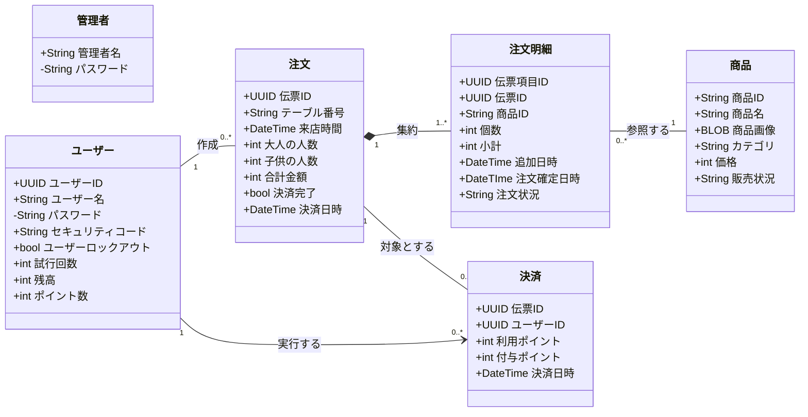

## 改版履歴
| 日付 | メンバー | バージョン | 概要 |
| :--- | :--- | :--- | :--- |
| 2025/12/05 | 蓬莱、星野、小野田 | 1.0 | 初版作成 |
| 2025/12/07 | 蓬莱、星野、小野田 | 2.0 | 第2版作成 |
| 2025/12/10 | 蓬莱、星野、小野田 | 2.1 | 第2版修正 |
| 2025/12/11 | 蓬莱、星野、小野田 | 3.0 | 第3版作成 |
| 2025/12/15 | 蓬莱、星野、小野田 | 3.1 | 第3版修正 |
| 2025/12/15 | 蓬莱、星野、小野田 | 3.2 | 第3版修正 |

## 各クラスの説明

#### クラス:管理者 (Admin)

| No | フィールド名 | 英名 | 型 | 備考 |
|:--:|:--|:--|:--|:--|
| 1 | 管理者名 | adminName | String | 一意の判別子 |
| 2 | パスワード | password | String | ハッシュ化して保存 |

#### クラス:商品 (Product)

| No | フィールド名 | 英名 | 型 | 備考 |
|:--:|:--|:--|:--|:--|
| 1 | 商品ID | productID | String | 一意の識別子 |
| 2 | 商品名 | productName | String | メニュー表示用 |
| 3 | 商品画像 | image | blob | 商品の画像 |
| 4 | カテゴリ | category | String | メニューの分類 |
| 5 | 価格 | price | int | 現在の単価 |
| 6 | 販売状況 | salesStatus | String | 販売中/準備中 |

#### クラス:注文 (Order)

| No | フィールド名 | 英名 | 型 | 備考 |
|:--:|:--|:--|:--|:--|
| 1 | 伝票ID | orderID | UUID | 一意の識別子 |
| 2 | テーブル番号 | tableNumber | String | - |
| 3 | 大人の人数 | adultCount | int | 1から8人 |
| 4 | 子供の人数 | childCount | int | 0から7人 |
| 5 | 決済完了 | isPaymentCompleted | bool |  |
| 6 | 来店日時 | visitDate | DateTime | 伝票生成日時 |
| 7 | 決済日時 | paymentDate | DateTime | 決済完了日時 |

#### クラス:注文明細 (OrderItem)

| No | フィールド名 | 英名 | 型 | 備考 |
|:--:|:--|:--|:--|:--|
| 1 | 伝票項目ID | orderItemID | UUID | 明細ごとの識別子 |
| 2 | 伝票ID | orderID | UUID | 親となる伝票 |
| 3 | 商品ID | productID | String | 注文した商品 |
| 4 | 個数 | quantity | int | - |
| 5 | 価格 | price | int | 注文した時点での商品価格 |
| 6 | 追加日時 | addDate | DateTime | - |
| 7 | 注文確定日時 | orderDate | DateTime | - |
| 8 | 注文状況 | orderStatus | String | 注文カゴ/調理中/提供済 |

#### クラス:ユーザー (User)

| No | フィールド名 | 英名 | 型 | 備考 |
|:--:|:--|:--|:--|:--|
| 1 | ユーザーID | userID | UUID | 一意の識別子 |
| 2 | ユーザー名 | userName | String | ログインID |
| 3 | パスワード | password | String | ハッシュ化して保存 |
| 4 | セキュリティコード | securityCode | String | ハッシュ化して保存 |
| 5 | 残高 | balance | int | 上限：500,000円 |
| 6 | ポイント数 | point | int | 保有ポイント |
| 7 | 試行回数 | loginAttempt | int | ログイン・決済失敗回数 |
| 8 | ユーザーロックアウト | isLockout | bool |  |

#### クラス:決済 (Payment)

| No | フィールド名 | 英名 | 型 | 備考 |
|:--:|:--|:--|:--|:--|
| 1 | 伝票ID | orderID | UUID | - |
| 2 | ユーザーID | userID | UUID | 支払いを行ったユーザー |
| 3 | 利用ポイント | usePoint | int | 支払いに充当したポイント |
| 4 | 付与ポイント | earnePoint | int | 決済により獲得したポイント |
| 5 | 決済日時 | paymentDate | DateTime | 決済完了日時 |