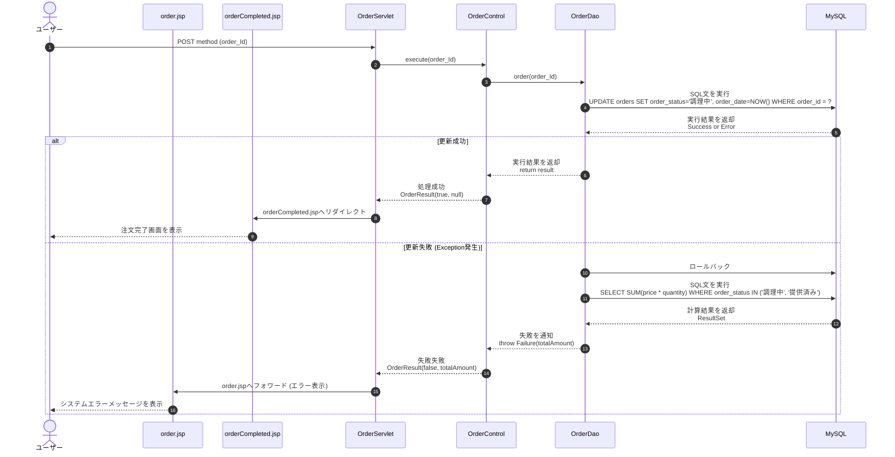
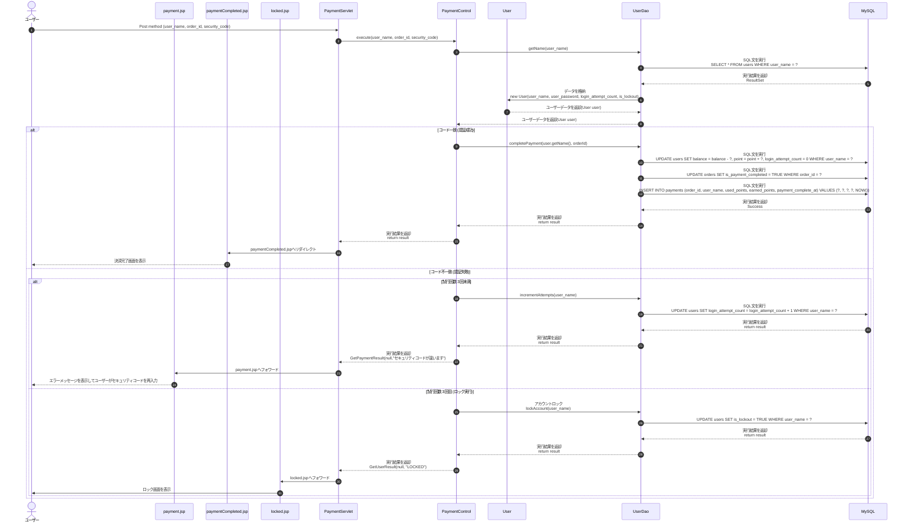
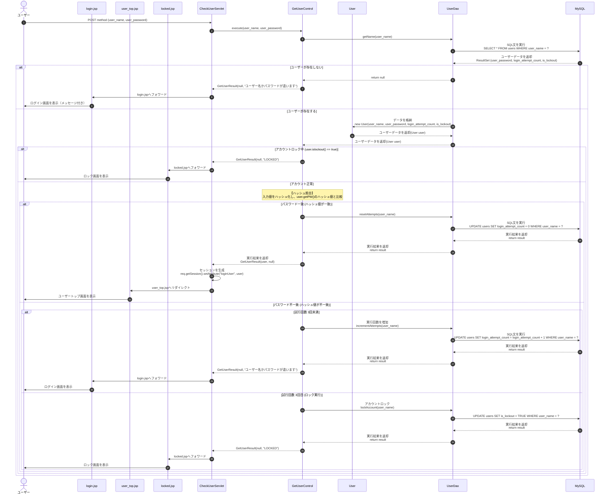
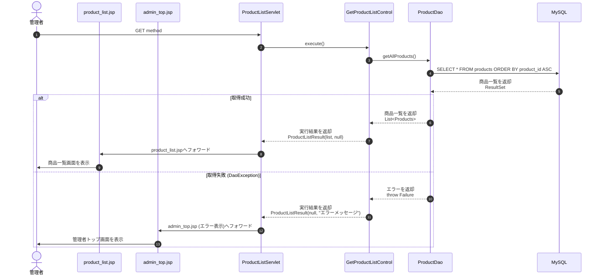
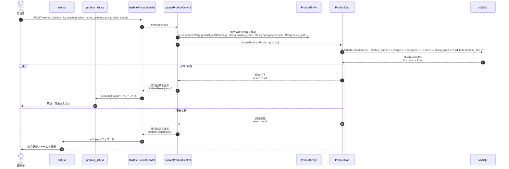
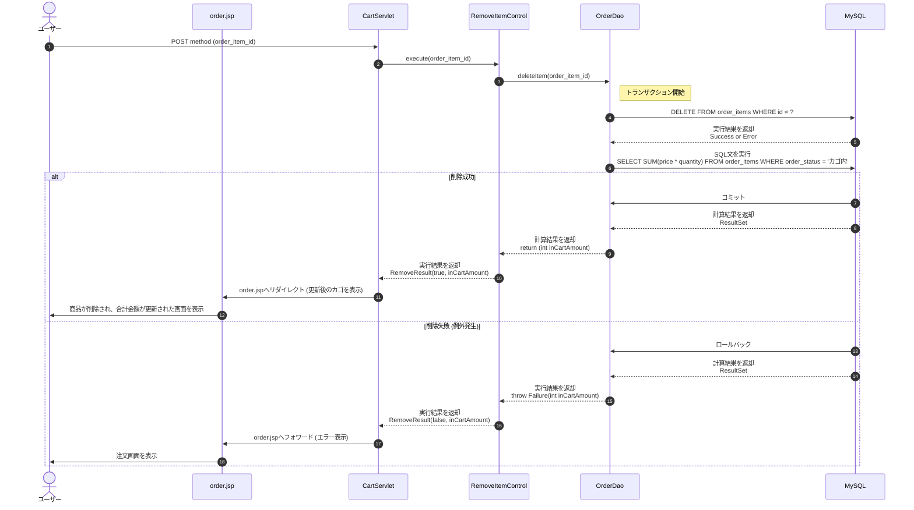
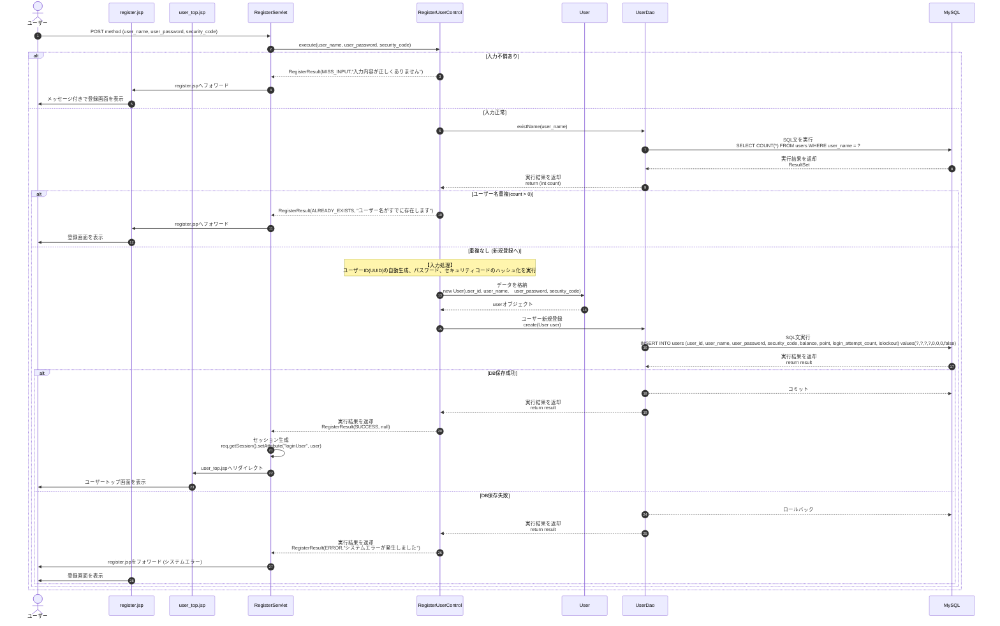

# シーケンス図

## 改版履歴
| 日付 | メンバー | バージョン | 概要 |
| :--- | :--- | :--- | :--- |
| 2025/12/04 | 小野田祐希、星野知史、蓬莱芽希 | 1.0 | 初版作成 |
| 2025/12/15 | 小野田祐希、星野知史、蓬莱芽希 | 1.1 | 初版修正 |
| 2025/12/16 | 小野田祐希、星野知史、蓬莱芽希 | 1.2 | ピアレビュー後修正 |
| 2025/12/20 | 小野田祐希、星野知史、蓬莱芽希 | 1.3 | ピアレビュー後再修正 |
| 2025/12/23 | 小野田祐希、星野知史、蓬莱芽希 | 1.4 | インスペクション後修正 |

## UPDATE：注文

### 説明
ユーザーは注文端末の注文画面上で内容を確認し、「注文確定」ボタンをクリックする。これにより、サーブレットに対してPOSTメソッドにより、注文確定のリクエスト（伝票ID）が送信される。

サーブレットは、コントロールに注文処理を依頼する。
コントロールは、DAOへ処理を委ねる。DAOはデータベース接続を確立してトランザクションを開始し、該当する伝票IDのステータスを「調理中」に更新するとともに、注文確定日時（現在日時）を記録する。
DAOは、更新の成否にかかわらず画面表示用として、現在の注文済み合計金額（ステータスが「調理中」または「提供済」の合計金額）を算出する。

* 更新に成功した場合 
   1. DAOは、最新の注文済み合計金額（ステータスが「調理中」または「提供済み」の合計金額）を算出し、コミットを実行して変更を確定させる。
   2. DAOは算出した合計金額を含めた成功結果を返し、サーブレットは「注文完了画面（orderCompleted.jsp）」へリダイレクトする。
   3. ユーザーが完了画面上の「OK」ボタンをクリックすると、システムは「注文画面（order.jsp）」へと遷移させる。
   4. 遷移後の画面では注文カゴが空になり、画面上の「注文済み合計金額」には今回の注文分を含んだ最新の金額が反映される。

* 更新に失敗した場合 
   1. 例外が発生した際、DAOはロールバックを実行し、データベースを注文確定前の状態（該当伝票のステータスが「カゴ内」の状態）に戻す。
   2. DAOは算出した合計金額を添えて失敗通知を投げ、サーブレットは注文画面（order.jsp）へフォワードする。
   3. ユーザーにはシステムエラーのメッセージが表示し、注文済み合計金額は前回の確定分までの正しい数値が維持される。
---

## UPDATE：決済

### 説明
　
ユーザーが決済画面において4桁のセキュリティコードを入力し終えると、システムは自動的に入力を検知し、サーブレットに対してユーザー名、伝票ID、入力コードを含むPOSTメソッドによる決済リクエストを送信する。

ユーザーが4桁のセキュリティコードを入力し終えると、システムは自動的に入力を検知し、POSTメソッドでサーブレットへリクエスト（ユーザーID、伝票ID、入力コード）を送信する。サーブレットはコントロールへ処理を依頼する。

サーブレットはコントロールに処理を依頼し、コントロールはまずDAOを通じてデータベースから該当ユーザーの情報を取得する。DAOは取得したデータをUserエンティティに格納してコントロールへ返却する。コントロール内部では、入力されたコード（ハッシュ化後）とエンティティ内の登録情報の照合を行う。

* 認証成功の場合（コード一致） 
    1. コントロールはDAOに対し、決済確定処理を依頼する。
    2. DAOはデータベース接続を確立してトランザクションを開始し、以下の3つの処理を実行する。
        * usersテーブル: 残高の減算、ポイントの付与または利用の反映、およびログイン試行回数のリセット。
        * ordersテーブル: 決済完了フラグ（is_payment_completed）をTRUEに更新。
        * paymentsテーブル: 決済日時や利用ポイント等の実績レコードを新たに挿入。
    3. 全ての更新が正常に完了した後、DAOはコミットを実行して変更を確定させる。
    4. サーブレットは決済完了画面（paymentCompleted.jsp）へリダイレクトし、ユーザーに決済が成功したことを通知する。

    * 認証失敗の場合（パスワード不一致） 
        * コントロールは現在の試行回数を確認し、処理を分岐させる。

        * 3回未満の場合 
            * コントロールはDAOに対し、試行回数の加算（+1）を依頼する。更新後、サーブレットはログイン画面（login.jsp）へフォワードし、ユーザーログイン画面に「セキュリティコードが違います」というエラーメッセージが表示する。

        * 3回目に達した場合 
            * コントロールはDAOに対し、ユーザー状況を「ロックアウト（TRUE）」に変更し、試行回数を加算するよう依頼し、認証失敗（LOCKED）を通知する。サーブレットはアカウントロック画面（locked.jsp）へフォワードし、メッセージを表示する。
---

## READ：ユーザー認証

### 説明
ユーザーはユーザーログイン画面（login.jsp）において、「ユーザー名」と「パスワード」を入力し「ログイン」ボタンをクリックする。これにより、サーブレットに対してPOSTメソッドにより、認証処理のリクエストが送信される。

サーブレットは、コントロールへ認証を依頼する。コントロールはDAOを呼び出し、入力されたユーザー名に該当するユーザー情報をデータベースから取得する。
DAOは取得したデータをUserエンティティに格納してコントロールへ返却する。認証の成否およびその後の画面遷移の判定は、コントロールが行う。

* ユーザーが存在しない場合
    * DAOからnullが返却され、コントロールは認証失敗の結果をサーブレットに返す。サーブレットはログイン画面（login.jsp）へフォワードし、「ユーザー名かパスワードが違います」というメッセージを表示する。
* アカウントロックの確認 
    * ユーザーが存在する場合、コントロールはまずエンティティ内のロック状態を確認する。is_lockoutがTRUEの場合、パスワード照合を行わずに認証失敗（LOCKED）を通知する。サーブレットはアカウントロック画面（locked.jsp）へフォワードし、メッセージを表示する。
* パスワード照合 
    * ロックされていない場合、コントロールは入力されたパスワードをハッシュ化し、エンティティが保持するDB上のハッシュ値と比較する。

    * 認証成功の場合 
        1. コントロールはDAOに対し、ログイン試行回数のリセット（0回への更新）を依頼する。
        2. DAOによる更新完了後、コントロールは成功結果（GetUserResult）をサーブレットへ返す。
        3. サーブレットはセッションを生成し、ログインユーザーの情報を保持する。
        4. その後、ユーザーホーム画面（user_top.jsp）へリダイレクトし、ログイン状態を確定させる。

    * 認証失敗の場合（パスワード不一致） 
        * コントロールは現在の試行回数を確認し、処理を分岐させる。

        * 3回未満の場合 
            * コントロールはDAOに対し、試行回数の加算（+1）を依頼する。更新後、サーブレットはログイン画面（login.jsp）へフォワードし、ユーザーログイン画面に「ユーザー名かパスワードが違います」というエラーメッセージが表示する。

        * 3回目に達した場合 
            * コントロールはDAOに対し、ユーザー状況を「ロックアウト（TRUE）」に変更し、試行回数を加算するよう依頼し、認証失敗（LOCKED）を通知する。サーブレットはアカウントロック画面（locked.jsp）へフォワードし、メッセージを表示する。
---

## READ：商品一覧表示

### 説明
管理者は管理者注文情報画面のメニューから「商品」を選択する。これにより、サーブレットに対してGETメソッドにより、商品一覧の表示のリクエストが送信される。

サーブレットはコントロールへ商品一覧の取得を依頼し、コントロールはDAOを通じてデータベースへの問い合わせを行う。
DAOはデータベース接続を確立し、productsテーブルから全商品情報を取得するためのSELECT文を実行する。

* 取得に成功した場合 
    1. DAOは、データベースから返却されたResultSetをリストに変換してコントロールに返す。
    2. コントロールは、取得したリストを含めた成功結果（ProductListResult）をサーブレットに返す。
    3. サーブレットは、取得した商品リストをリクエストスコープに格納し、「商品一覧表示画面（product_list.jsp）」へフォワード。
    4. 管理者には、全商品のリストが表示される。

* 取得に失敗した場合 
    1. データベース接続エラーやSQLエラーが発生した際、DAOはコントロールに対して失敗を通知する。
    2. コントロールは、エラーメッセージを含めた失敗結果をサーブレットへ返す。
    3. サーブレットは、「管理者トップ画面（admin_top.jsp）」へフォワードし、画面上にシステムエラーのメッセージを管理者に表示する。
---

## UPDATE：商品情報の更新

### 説明
管理者は商品更新フォーム画面（edit.jsp）において情報を修正し、「更新」ボタンをクリックする。これにより、サーブレットに対して修正された各項目（ID、画像、商品名、カテゴリ、価格、販売ステータス）を含むPOSTメソッドのリクエストが送信される。

サーブレットは、コントロールに更新処理を依頼する。
コントロールは、受け取った入力情報をProductエンティティに格納し、DAOへ処理を委ねる。productsテーブルに対し、対象となる商品情報の更新（UPDATE）を実行する。

* 更新に成功した場合 
    1. DAOは変更を確定させ、成功結果を返す。
    2. サーブレットは、ブラウザを商品一覧画面（product_list.jsp）へリダイレクトさせる。
    3. 管理者には、更新内容が反映された最新の商品リストが表示される。

* 更新に失敗した場合 
    1. DAOは変更を取り消し、失敗結果を返す。
    2. サーブレットは、商品更新フォーム画面（edit.jsp）へフォワードし、画面を再生成する。
    3. 管理者には、商品更新フォームが表示される。
---

## DELETE：注文カゴ取り消し

### 説明

ユーザーはは注文画面（order.jsp）の注文カゴ一覧において、不要な商品の「商品取り消し」ボタンをクリックする。これにより、サーブレットに対して削除対象となる注文項目IDを含むPOSTメソッドにより、処理のリクエストが送信される。

サーブレットはコントロールに処理を依頼し、コントロールはDAOへ項目の削除処理を委ねる。
DAOはデータベース接続を確立してトランザクションを開始し、まず対象となる商品のレコードをテーブルから削除する。続いてDAOは、削除後の状態（または削除失敗によるロールバック後の状態）における注文カゴ合計金額を算出する。

* 削除に成功した場合 
    1. DAOは、今回の削除を反映した状態でカゴ内の商品の合計金額を再計算し、コミットを実行して変更を確定させる。
    2. DAOは算出した新しい合計金額を含めた成功結果を返し、サーブレットは注文画面（order.jsp）へリダイレクトを行う。
    3. ユーザーには、該当商品が削除され、請求合計金額が正しく更新された状態の画面が表示される。

* 削除に失敗した場合 
    1. 削除処理中に例外が発生した際、DAOはロールバックを実行して変更を取り消し、データベースを削除前の状態に戻す。
    2. DAOは再度合計金額を算出することで、削除されずに残った合計金額を取得する。
    3. DAOは算出した金額を添えて失敗通知を投げ、サーブレットは注文画面（order.jsp）へフォワードを行う。
    4. ユーザーにはシステムエラーのメッセージが表示されるが、注文カゴの内容や合計金額は削除前の正しい状態が維持される。

## CREATE：ユーザー新規登録

### 説明
ユーザーは新規登録画面（register.jsp）において、「ユーザー名」「パスワード」「セキュリティコード」を入力し、「登録」ボタンをクリックする。これにより、サーブレットに対してPOSTメソッドによる登録リクエストが送信される。

サーブレットはコントロールへ登録処理を依頼し、コントロールはまずDAOを通じてデータベースに対し、入力されたユーザー名が既に登録されていないか（重複チェック）を問い合わせる。

DAOは該当するユーザー名のデータ件数を返し、コントロールはその件数を見て判断を行う。

* 入力不備がある場合
    * コントロールは、まず入力内容の整合性を確認する。必須項目の未入力や、文字数不足、文字種（セキュリティコードが半角数字4桁であるか等）に不備がある場合、データベースへの問い合わせを行わずに処理を中断する。
    * コントロールは「入力不備エラー」をサーブレットに通知し、サーブレットは登録画面（register.jsp）へフォワードし、具体的な不備内容をユーザーに表示する。
* 重複がある場合（件数が1件以上） 
    ・ コントロールは処理を中断してエラーを通知する。サーブレットは登録画面を再生成し、画面上に「ユーザー名が重複しています」等のメッセージを表示させる。

* 重複がない場合（件数が0件） 
    * コントロールは内部で入力処理を行い、ユーザーID（UUID）の自動生成、およびパスワードとセキュリティコードのハッシュ化を実行する。
    * 生成した情報をUserエンティティに格納し、DAOへユーザー情報の新規登録を依頼する。
    * DAOはデータベース接続を確立してトランザクションを開始し、usersテーブルに対して、残高やポイント、試行回数などの初期値を設定した状態でレコードを挿入する。

    * 登録に成功した場合 
        1. DAOはコミットを実行して変更を確定させ、成功結果を返す。
        2. コントロールは成功結果（SUCCESS）をサーブレットへ返し、サーブレットはリクエストスコープから情報を受け取ってセッションを生成し、ログインユーザー情報を保持する。
        3. ユーザートップ画面（user_top.jsp）へリダイレクトし、新規登録したユーザーにホーム画面を表示する。

    * 登録に失敗した場合 
        1. データベース通信エラーなどの例外が発生した際、DAOはロールバックを実行して変更を取り消し、失敗結果を返す。
        2. コントロールはシステムエラーを通知し、サーブレットは登録画面（register.jsp）へフォワードし、ユーザーは再度、登録情報を入力し直すことができる。

## 依存成果物のURL
 [機能仕様書](https://github.com/HazeyamaLab/se25g2/blob/main/docs/development/%E6%A9%9F%E8%83%BD%E4%BB%95%E6%A7%98%E6%9B%B8/%E3%82%B7%E3%82%B9%E3%83%86%E3%83%A0%E3%83%97%E3%83%AD%E3%82%B0%E3%83%A9%E3%83%9F%E3%83%B3%E3%82%B0%E3%80%80%E6%A9%9F%E8%83%BD%E4%BB%95%E6%A7%98%E6%9B%B8version9.1.md)
 
 [画面設計Figma](https://www.figma.com/design/E3nKQ29jgw419mN1d2lSGu/%E3%82%A4%E3%83%B3%E3%82%B9%E3%83%9A%E3%82%AF%E3%82%B7%E3%83%A7%E3%83%B3%E7%94%A8?m=auto&t=efwNZ0rrwyySUqni-1f)
 
 [クラス図](https://github.com/HazeyamaLab/se25g2/blob/main/docs/development/class-diagram/%E3%82%AF%E3%83%A9%E3%82%B9%E5%9B%B3_version3.2.md)

 [データベース設計](https://github.com/HazeyamaLab/se25g2/pull/14)
 
 [ステートチャート図](https://github.com/HazeyamaLab/se25g2/blob/main/docs/development/statechart/%E3%82%B9%E3%83%86%E3%83%BC%E3%83%88%E3%83%81%E3%83%A3%E3%83%BC%E3%83%88%E5%9B%B3_version1.0.md)