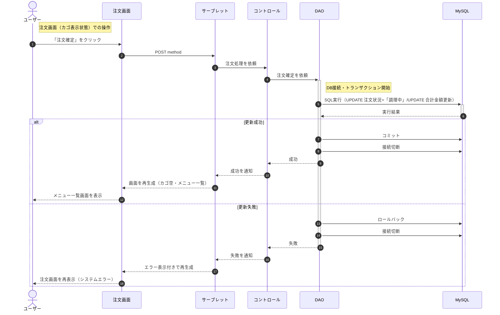
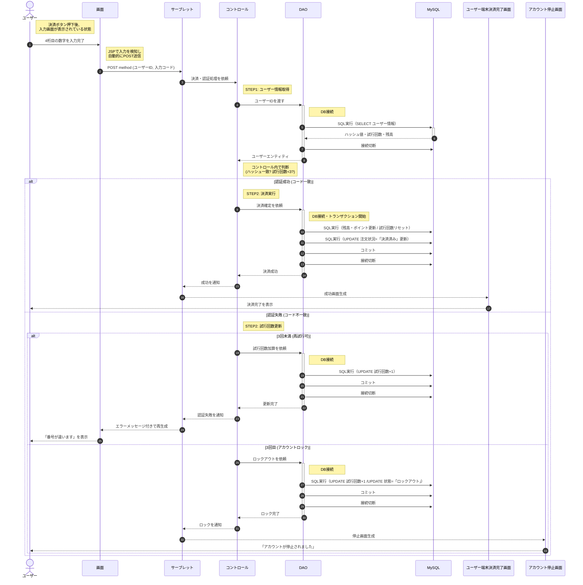
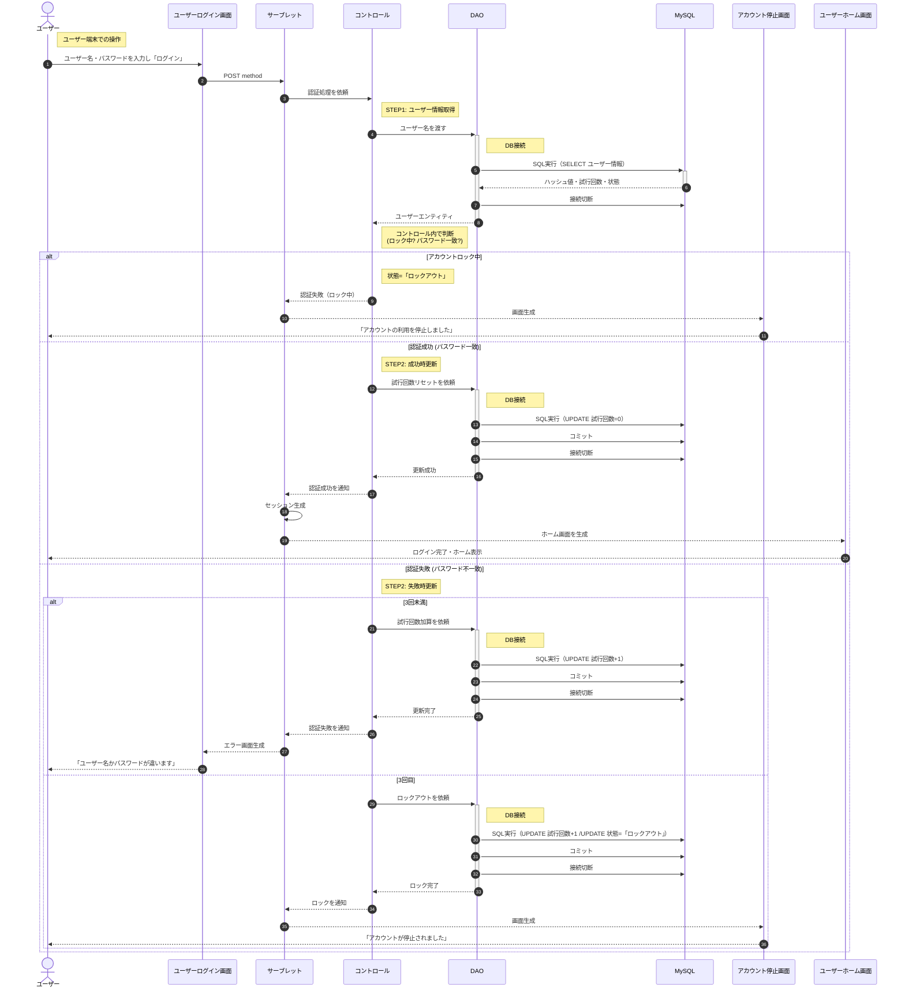
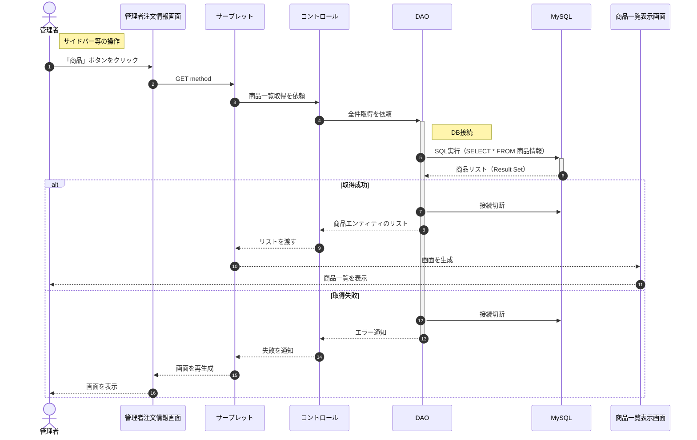
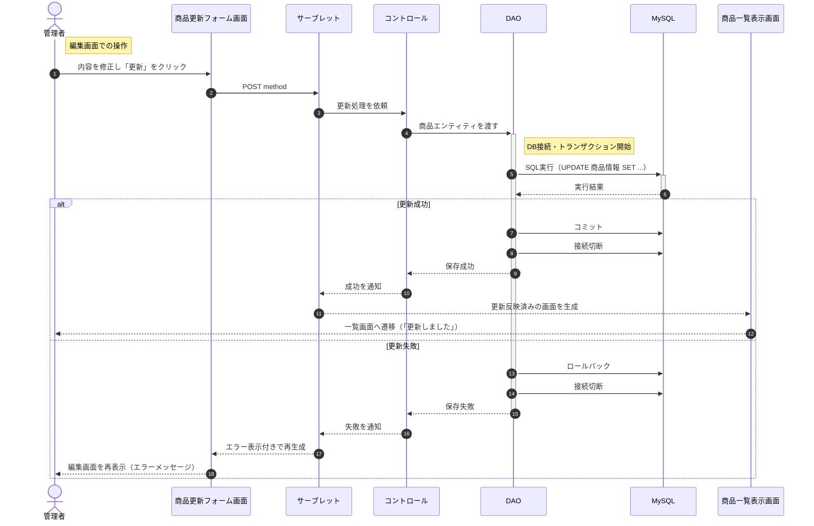
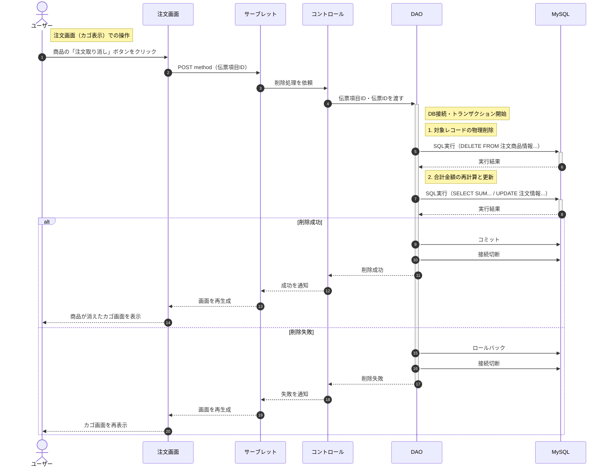
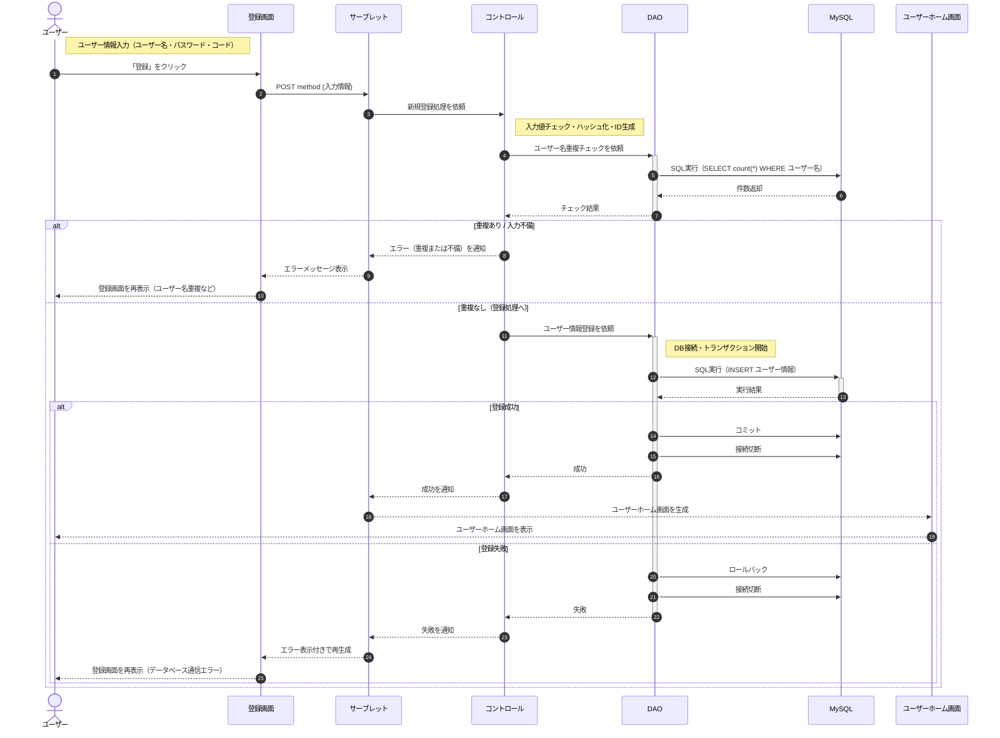

# シーケンス図

## 改版履歴
| 日付 | メンバー | バージョン | 概要 |
| :--- | :--- | :--- | :--- |
| 2025/12/04 | 小野田祐希、星野知史、蓬莱芽希 | 1.0 | 初版作成 |
| 2025/12/15 | 小野田祐希、星野知史、蓬莱芽希 | 1.1 | 初版修正 |
| 2025/12/16 | 小野田祐希、星野知史、蓬莱芽希 | 1.2 | ピアレビュー後修正 |
 
 ## UPDATE：注文

### 説明
ユーザーは注文端末の注文画面上で内容を確認し、「注文確定」ボタンをクリックする。これにより、サーブレットに対してPOSTメソッドにより、注文確定のリクエストが送信される。

サーブレットは、コントロールに注文処理を依頼する。
コントロールは、DAOへ処理を委ねる。DAOはデータベース接続を確立してトランザクションを開始し、該当する伝票IDのステータスを「調理中」に更新すると共に、合計金額の更新を行う。

* 更新に成功した場合 
   * DAOはコミットを実行して変更を確定させ、成功結果を返す。サーブレットはメニュー一覧画面（カゴが空の状態）を生成し、ユーザーに表示する。

* 更新に失敗した場合 
   * DAOはロールバックを実行して変更を取り消し、失敗結果を返す。サーブレットは注文画面を再生成し、システムエラーのメッセージと共にユーザーに表示する。
---

## UPDATE：決済

### 説明
　
ユーザーがユーザー端末の決済画面で「決済」を選択すると、セキュリティコード入力画面が表示される。

ユーザーが4桁のセキュリティコードを入力し終えると、システムは自動的に入力を検知し、POSTメソッドでサーブレットへリクエストを送信する。サーブレットはコントロールへ処理を依頼する。

コントロールは、DAOを通じてデータベースから該当ユーザーの「登録済みセキュリティコード（ハッシュ値）」「現在の試行回数」「残高」を取得する。
コントロールが入力されたセキュリティコードと登録情報を照合する。

* 認証成功の場合（コード一致） 
    * コントロールはDAOに対し、決済確定処理を依頼する。DAOはデータベースに接続し、試行回数のリセット（0回）、残高とポイントの更新、および注文情報の「決済済み」への更新をトランザクション内で実行する。コミット後、サーブレットを通じて ユーザー端末決済完了画面を表示する。

* 認証失敗の場合（コード不一致） 
    * コントロールは現在の試行回数を確認する。
    * 3回未満の場合 
        * コントロールはDAOに対し、試行回数の加算（+1）のみを依頼する。更新後、セキュリティコード入力画面を再表示し、エラーメッセージを通知する。
    * 3回に達した場合  
        * コントロールはDAOに対し、ユーザー状況を「ロックアウト」に変更するよう依頼する。DAOによる更新後、サーブレットは アカウント停止画面を表示する。
---

## READ：ユーザー認証

### 説明
ユーザーはユーザーログイン画面において、ユーザー名とパスワードを入力し「ログイン」ボタンをクリックする。これにより、サーブレットに対してPOSTメソッドにより、認証処理のリクエストが送信される。

サーブレットは、コントロールへ認証を依頼する。コントロールはDAOを呼び出し、入力されたユーザー名に該当するユーザー情報をデータベースから取得する。
DAOはデータを返すだけであり、照合判定はコントロールが行う。

* アカウントロックの確認 
    * 取得したユーザー状況が「ロックアウト」の場合、コントロールは即座に認証失敗とする。サーブレットはアカウント停止画面を表示する。

* パスワード照合 
    * ロックされていない場合、コントロールは入力されたパスワードをハッシュ化し、取得したDB上のハッシュ値と比較する。

    * 認証成功の場合 
        * コントロールはDAOに対し、試行回数のリセット（0回）を依頼する。DAOはトランザクションを開始して更新し、コミット後に成功結果を返す。サーブレットはセッションを生成し、ユーザーホーム画面へ遷移させる。

    * 認証失敗の場合（パスワード不一致） 
        * コントロールは現在の試行回数を確認し、処理を分岐させる。

        * 3回未満の場合 
            * コントロールはDAOに対し、試行回数の加算（+1）を依頼する。DAOは更新をコミットして成功結果を返す。サーブレットへは認証失敗が通知され、ユーザーログイン画面に「ユーザー名かパスワードが違います」というエラーメッセージが表示される。

        * 3回目に達した場合 
            * コントロールはDAOに対し、ユーザー状況を「ロックアウト」に変更し、試行回数を加算するよう依頼する。DAOは更新をコミットして成功結果を返す。サーブレットへはアカウントロックが通知され、アカウント停止画面が生成されて「アカウントが停止されました」という警告画面が表示される。
---

## READ：商品一覧表示

### 説明
管理者は管理者注文情報画面のメニューから「商品」を選択する。これにより、サーブレットに対してGETメソッドにより、商品一覧の表示リクエストが送信される。

サーブレットは、コントロールに商品一覧取得を依頼する。
コントロールは、DAOへ処理を委ねる。DAOはデータベース接続を確立し、全商品情報の取得（SELECT）を実行する。

* 取得に成功した場合 
    * DAOは接続を切断し、取得した商品エンティティのリストを返す。サーブレットは商品一覧表示画面を生成し、登録されている商品リストを管理者に表示する。

* 取得に失敗した場合 
    * DAOは接続を切断し、失敗結果を返す。サーブレットは管理者注文情報画面を再生成し、管理者に表示する。
---

## UPDATE：商品情報の更新

### 説明
管理者は商品更新フォーム画面において情報を修正し、「更新」ボタンをクリックする。これにより、サーブレットに対してPOSTメソッドにより、更新処理のリクエストが送信される。

サーブレットは、コントロールに更新処理を依頼する。
コントロールは、DAOへ処理を委ねる。DAOはデータベース接続を確立してトランザクションを開始し、対象となる商品情報の更新（UPDATE）を実行する。

* 更新に成功した場合 
    * DAOはコミットを実行して変更を確定させ、成功結果を返す。サーブレットは商品一覧表示画面を生成し、更新内容が反映されたリストを管理者に表示する。

* 更新に失敗した場合 
    * DAOはロールバックを実行して変更を取り消し、失敗結果を返す。サーブレットは商品更新フォーム画面を再生成し、エラーメッセージと共に管理者に表示する。
---

## DELETE：注文取り消し

### 説明

ユーザーは注文画面（注文カゴ一覧）において、不要な商品の「商品取り消し」ボタンをクリックする。これにより、サーブレットに対してPOSTメソッドにより、削除処理のリクエスト（伝票項目ID）が送信される。

サーブレットは、コントロールに削除処理を依頼する。

コントロールは、DAOへ処理を委ねる。DAOはデータベース接続を確立してトランザクションを開始し、まず対象となる商品のレコードをテーブルから削除する。

商品削除に伴う請求額の変更を反映させるため、残りの商品から合計金額を再計算し、注文情報の合計金額を更新する。

* 削除に成功した場合 
    * DAOはコミットを実行して変更を確定させ、成功結果を返す。サーブレットは注文画面を再生成し、該当商品が削除され、合計金額が更新された状態の画面をユーザーに表示する。

* 削除に失敗した場合 
    * DAOはロールバックを実行して変更を取り消し、失敗結果を返す。サーブレットは注文画面を再生成し、ユーザーに表示する。

## CREATE：ユーザー新規登録

### 説明
ユーザーはユーザー端末の登録画面でユーザー名・パスワード・セキュリティコードを入力し、「登録」ボタンをクリックする。これにより、サーブレットに対してPOSTメソッドにより、新規登録のリクエストが送信される。

サーブレットは、コントロールに入力情報の処理を依頼する。

コントロールは、まず入力チェック（桁数や文字種の確認）を行い、パスワードとセキュリティコードをハッシュ化する。
コントロールはDAOを通じてデータベースに問い合わせ、入力されたユーザー名が既に存在しないか（重複チェック）を確認する。

DAOは該当するユーザー名のデータ件数を返し、コントロールはその件数を見て判断を行う。

* 重複がある場合（件数が1件以上）、または入力不備がある場合 
    ・ コントロールは処理を中断してエラーを通知する。サーブレットは登録画面を再生成し、画面上に「ユーザー名が重複しています」等のメッセージを表示させる。

* 重複がない場合（件数が0件） 
    * コントロールはDAOに対してユーザー情報の新規登録（INSERT）を依頼する。
    * DAOはデータベース接続を確立してトランザクションを開始し、ユーザー情報をテーブルに登録する。

    * 登録に成功した場合 
        * DAOはコミットを実行して変更を確定させ、成功結果を返す。サーブレットは「ユーザーホーム画面」を生成し、ログイン状態となったユーザに表示する。

    * 登録に失敗した場合 
        * DAOはロールバックを実行して変更を取り消し、失敗結果を返す。サーブレットはシステムエラー（データベース通信失敗など）として登録画面を再生成し、エラーメッセージを表示する。

## 依存成果物のURL
 [機能仕様書](https://github.com/HazeyamaLab/se25g2/blob/main/docs/development/%E6%A9%9F%E8%83%BD%E4%BB%95%E6%A7%98%E6%9B%B8/%E3%82%B7%E3%82%B9%E3%83%86%E3%83%A0%E3%83%97%E3%83%AD%E3%82%B0%E3%83%A9%E3%83%9F%E3%83%B3%E3%82%B0%E3%80%80%E6%A9%9F%E8%83%BD%E4%BB%95%E6%A7%98%E6%9B%B8version9.1.md)
 
 [画面設計Figma](https://www.figma.com/design/lzUis57XlxyyV00hpEj4Gv/G2%E7%94%BB%E9%9D%A2%E8%A8%AD%E8%A8%88-%EF%BC%88%E7%AC%AC%EF%BC%92%E5%9B%9E%E3%82%A4%E3%83%B3%E3%82%B9%E3%83%9A%E3%82%AF%E3%82%B7%E3%83%A7%E3%83%B3%EF%BC%89?node-id=0-1&t=FUHm8Ba6dhTTQ8JV-1)
 
